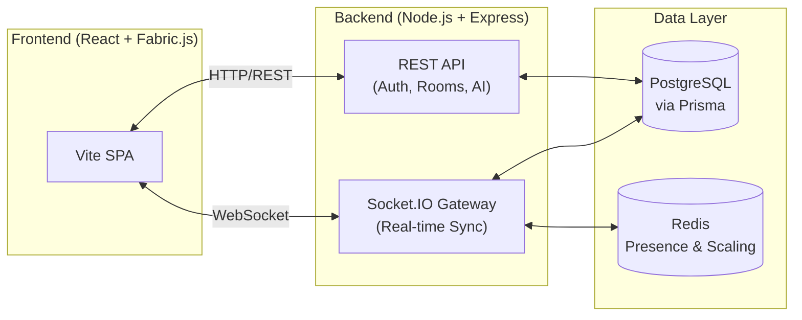

<div align="center">
  <br />
  <h1>🎨 CollabCanvas</h1>
  <p>
    <strong>Room-based collaborative whiteboard built with React, TypeScript, Fabric.js, Node.js, and Socket.IO.</strong>
  </p>
  <p>
    <a href="https://collabcanvas-eight.vercel.app">Live Demo</a> •
    <a href="#-architecture">Architecture</a> •
    <a href="#-features">Features</a> •
    <a href="#-getting-started">Getting Started</a>
  </p>
  <br />
</div>

## 🌟 Overview
CollabCanvas is a production-ready, real-time collaborative whiteboard. It features role-based permissions, an ordered operation log with optimistic sync, offline support, and AI-powered board summaries.

## 🏗 Architecture
The application follows a robust client-server architecture with real-time bidirectional communication.



<details>
<summary><strong>View Detailed Technical Stack</strong></summary>

- **Frontend**: React 19, TypeScript, Vite, Tailwind CSS, Fabric.js (Rendering layer)
- **Backend**: Node.js, Express, Socket.IO, Prisma ORM, Zod (Validation)
- **Database**: PostgreSQL (Neon/Supabase) for persistence
- **Scaling/Cache**: Redis (Upstash) for Socket.IO scaling, presence, and rate limits
- **AI**: Google Gemini API for board summaries
</details>

## ✨ Features
- 🛡️ **Role-Based Collaboration**: Authenticated rooms with Owner, Editor, and Viewer permissions.
- 🔄 **Real-Time Sync**: Optimistic UI updates with ordered operation logs and reconnect recovery.
- 💾 **Robust Persistence**: PostgreSQL storage for boards, snapshots, versions, and operations.
- 💬 **Interactive Tools**: Object-level comments, room chat, and activity feeds.
- 🤖 **AI Summaries**: Built-in Gemini integration to generate meeting notes and action items.
- 📶 **Offline Support**: Queue edits offline and sync seamlessly upon reconnection.
- ⏪ **Replay Mode**: Step-by-step playback of board history.

## 🚀 Getting Started

### Prerequisites
- Node.js (v18+)
- PostgreSQL database
- Redis instance (optional, for scaling)

### 1. Clone & Install
```bash
# Install frontend dependencies
npm install

# Install backend dependencies
cd backend
npm install
```

### 2. Environment Variables
Create `.env` in the root:
```env
VITE_SOCKET_URL=http://localhost:5000
VITE_API_URL=http://localhost:5000
```

Create `backend/.env`:
```env
DATABASE_URL="your-postgres-url"
FRONTEND_URL="http://localhost:5173"
CLIENT_ORIGIN="http://localhost:5173"
PORT=5000
NODE_ENV="development"
JWT_SECRET="your-secret"
COOKIE_SECRET="your-cookie-secret"
CORS_ORIGINS="http://localhost:5173"
GEMINI_API_KEY="your-gemini-key" # Optional
```

### 3. Start Development Servers
```bash
# Backend (in /backend)
npm run prisma:generate
npm run prisma:migrate
npm run seed
npm run dev

# Frontend (in root)
npm run dev
```

## 📚 Documentation
<details>
<summary><strong>Deep Dive into Core Systems</strong></summary>

- **Object-Based Editing**: Fabric.js renders a React state array of `WhiteboardObject`s. History is based on snapshots.
- **Operation Log**: All edits resolve to JSON operations (CREATE/UPDATE/DELETE). The backend applies them in sequence order to resolve conflicts.
- **Offline Sync**: Local edits are cached in IndexedDB. Upon reconnection, missed operations are fetched, and local queue is flushed.
- **Permissions**: Enforced twice (UI and backend) via `permissionManager.ts`. Owners control room settings; Editors can draw/comment; Viewers are read-only.
- **Exports & Replay**: Boards can be exported to PNG, PDF, or JSON. Replay mode plays back operations sequentially without mutating the actual board state.
</details>

<details>
<summary><strong>Deployment Guidelines</strong></summary>

- **Frontend (Vercel)**: Build with `npm run build`. Set `VITE_API_URL` and `VITE_SOCKET_URL` to point to the backend.
- **Backend (Render)**: Build with `npm ci --include=dev && npm run prisma:generate && npm run build`. Ensure `DATABASE_URL` and `REDIS_URL` are configured properly.
</details>

## 🧪 Testing
```bash
npm run test           # Frontend tests
npm --prefix backend run test # Backend tests
```
