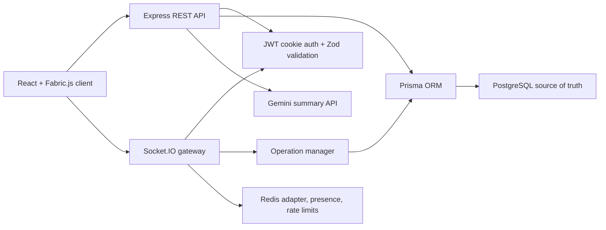

# CollabCanvas

Room-based collaborative whiteboard built with React, TypeScript, Tailwind CSS, Fabric.js, Node.js, Express, and Socket.IO.

## Architecture



## Feature List

- Authenticated room-based whiteboards with role permissions.
- Structured object model rendered through Fabric.js.
- Ordered operation log with optimistic sync, reconnect recovery, offline queue, and replay mode.
- PostgreSQL persistence for rooms, boards, operations, snapshots, versions, comments, chat, exports, and AI summaries.
- Redis-backed Socket.IO scaling, presence, and rate limiting.
- Dashboard board lifecycle, invite management, thumbnails, exports, chat, object comments, activity feed, and Gemini summaries.
- Production hardening with validation, logging, security middleware, tests, Docker, and deployment documentation.

## Frontend Setup

```bash
npm install
npm run dev
```

The frontend runs at `http://localhost:5173`.

## Backend Setup

```bash
cd backend
npm install
npm run prisma:generate
npm run prisma:migrate
npm run seed
npm run dev
```

The backend runs at `http://localhost:5000`.

## Environment

Root `.env`:

```bash
VITE_SOCKET_URL=http://localhost:5000
VITE_API_URL=http://localhost:5000
```

Backend `.env`:

```bash
DATABASE_URL=""
FRONTEND_URL="http://localhost:5173"
CLIENT_ORIGIN="http://localhost:5173"
PORT=5000
NODE_ENV="development"
JWT_SECRET=""
COOKIE_SECRET=""
CORS_ORIGINS="http://localhost:5173"
API_RATE_LIMIT_PER_MINUTE=300
JSON_BODY_LIMIT="1mb"
LOG_LEVEL="debug"
GEMINI_API_KEY=""
REDIS_URL=""
REDIS_HOST=""
REDIS_PORT=""
REDIS_PASSWORD=""
REDIS_TLS=""
INSTANCE_ID=""
```

## Build Commands

```bash
npm run build
cd backend
npm run build
```

## Folder Structure

```text
src/
  components/
    CanvasBoard.tsx
    CollaborationSidebar.tsx
    ParticipantPanel.tsx
    RoomSettingsPanel.tsx
    ToolButton.tsx
    Toolbar.tsx
    VersionHistoryPanel.tsx
  hooks/
    useCanvasHistory.ts
    useRoomCollaboration.ts
  lib/
    connectionStatus.ts
    ids.ts
    offlineQueue.ts
    room.ts
    syncManager.ts
    whiteboardObjects.ts
  types.ts
  App.tsx
  main.tsx
  index.css
backend/
  prisma/
    schema.prisma
    seed.ts
  src/
    apiRoutes.ts
    activityService.ts
    aiSummaryService.ts
    chatService.ts
    commentService.ts
    exportService.ts
    messageUtils.ts
    operationManager.ts
    persistenceManager.ts
    permissionMiddleware.ts
    permissionManager.ts
    presenceService.ts
    prisma.ts
    rateLimiter.ts
    redisClient.ts
    roleGuards.ts
    roomManager.ts
    roomSettingsService.ts
    server.ts
    socketAdapter.ts
    socketChatHandlers.ts
    socketCommentHandlers.ts
    socketHandlers.ts
    types.ts
```

## Object-Based Editing

Fabric.js is used as the rendering and direct-manipulation layer only. The source of truth is a React state array of structured `WhiteboardObject` items. Each canvas item gets a unique `id` plus a normalized type:

```ts
type WhiteboardObject = {
  id: string;
  type: 'path' | 'rectangle' | 'circle' | 'line' | 'text';
  x: number;
  y: number;
  width?: number;
  height?: number;
  radius?: number;
  points?: unknown;
  text?: string;
  strokeColor: string;
  fillColor?: string;
  strokeWidth: number;
  createdBy?: string;
  createdAt: number;
  updatedAt: number;
  deleted?: boolean;
  deletedAt?: number;
  deletedBy?: string;
};
```

The helpers in `src/lib/whiteboardObjects.ts` keep the boundary clear:

- `serializeCanvas()` converts Fabric objects into the board object model.
- `loadCanvasFromObjects()` renders structured objects back into Fabric.
- `createWhiteboardObject()` creates a structured object from a Fabric item.
- `updateWhiteboardObject()` updates one item in the React object array.
- `deleteWhiteboardObject()` removes an item from the React object array.

## Undo and Redo

Canvas history is stored locally as snapshots of the structured `WhiteboardObject[]` state. The first empty board state is captured when the canvas initializes. After drawing, adding shapes, editing text, moving, resizing, deleting, or clearing, the latest object array is pushed onto the undo stack.

Undo moves the current object snapshot to a redo stack and reloads the previous object array into Fabric. Redo does the reverse. Because history is based on object snapshots instead of Fabric JSON, the same model can later be sent across a network or persisted without depending on Fabric internals.

## Real-Time Collaboration

The board has a sync-friendly state model: create, update, and delete actions all resolve into plain JSON objects with stable IDs and timestamps. Socket.IO sends object-level operations instead of pixels or Fabric-specific payloads.

## Operation Log Design

The frontend opens rooms at `/room/:roomId`. Creating a room emits `room:create`; joining or reconnecting emits `room:join`. The backend keeps rooms and participants in `roomManager.ts`, permissions in `permissionManager.ts`, and ordered room operation logs in `operationManager.ts`.

Every whiteboard edit is submitted as `operation:submit`. The client sends the operation intent with `clientTimestamp`; the backend validates the user and room, assigns `serverTimestamp` and a monotonically increasing `sequenceNumber`, appends the operation to the room log, and rebuilds the active board state by replaying operations in sequence order.

Applied operations have this shape:

```ts
{
  opId: string;
  roomId: string;
  boardId: string;
  objectId: string;
  type: 'CREATE' | 'UPDATE' | 'DELETE';
  payload: WhiteboardObject | null;
  previousPayload?: WhiteboardObject | null;
  userId: string;
  clientTimestamp: number;
  serverTimestamp: number;
  sequenceNumber: number;
}
```

## Socket.IO Flow

The sender gets `operation:ack`. Other room users get `operation:applied`, so the sender does not receive duplicate operations for edits already applied optimistically. New users receive `board:full-sync` with the active board and latest sequence number.

Cursor presence uses throttled `cursor:move` events. Each client broadcasts pointer coordinates in canvas space, and other clients render those cursors with the sender name.

## Conflict Handling

The operation log is the authority. `CREATE` adds an object only when the `objectId` is not already active. `UPDATE` applies only when the object exists and is not deleted. `DELETE` soft-deletes the object by setting `deleted`, `deletedAt`, and `deletedBy`. If two users update the same object, the operation with the later server `sequenceNumber` wins because the board state is replayed in backend order.

## Reconnect Recovery

Clients keep `lastSeenSequenceNumber` in local storage per room. On reconnect they rejoin the room and emit `operation:missed-request` with that number. The backend responds with `operation:missed-response`, containing operations after the requested sequence. The client applies missed remote operations first, then flushes locally queued operations in order with `operation:submit-batch`.

## Database Persistence

PostgreSQL with Prisma is the source of truth. In-memory room and board state is only a cache for active Socket.IO sessions. Accepted operations are saved in a transaction with the board `currentState` and `lastSequenceNumber`, so server restarts can restore the board from the database.

Prisma models live in `backend/prisma/schema.prisma`:

- `User`
- `Room`
- `Board`
- `Participant`
- `DrawingOperation`
- `BoardSnapshot`
- `BoardVersion`
- `Comment`
- `ChatMessage`
- `ActivityLog`
- `AISummary`
- `BoardExport`

Use Neon PostgreSQL or Supabase PostgreSQL by putting the connection string in `backend/.env` as `DATABASE_URL`.

## API Routes

- `POST /api/auth/signup` creates a user and sets the HTTP-only auth cookie.
- `POST /api/auth/login` verifies credentials and sets the HTTP-only auth cookie.
- `POST /api/auth/logout` clears the auth cookie.
- `GET /api/auth/me` returns the authenticated user.
- `GET /api/dashboard/boards` returns searchable/filterable dashboard board cards.
- `POST /api/rooms` creates a persisted room, board, owner participant, and invite code.
- `GET /api/rooms/:roomId` returns room details, boards, and participants.
- `POST /api/rooms/:roomId/join` persists participant membership.
- `PATCH /api/rooms/:roomId/settings` updates public/private, viewer comments, viewer AI summaries, viewer exports, viewer replay, and board lock settings.
- `PATCH /api/rooms/:roomId/invite-settings` updates invite enabled, invite role, invite expiry, and visibility.
- `POST /api/rooms/:roomId/regenerate-invite` regenerates the invite code.
- `POST /api/rooms/:roomId/participants` invites a participant.
- `PATCH /api/rooms/:roomId/participants/:userId` changes a participant role.
- `DELETE /api/rooms/:roomId/participants/:userId` removes a participant.
- `POST /api/rooms/:roomId/transfer-owner` transfers ownership.
- `POST /api/boards` creates a new dashboard board.
- `PATCH /api/boards/:boardId` renames, pins, or updates a board thumbnail.
- `POST /api/boards/:boardId/duplicate` duplicates a board for owners/editors.
- `POST /api/boards/:boardId/archive` archives a board.
- `POST /api/boards/:boardId/restore` restores an archived board.
- `DELETE /api/boards/:boardId` soft-deletes a board.
- `GET /api/boards/:boardId` returns the persisted board state and latest sequence.
- `GET /api/boards/:boardId/versions` lists named versions.
- `POST /api/boards/:boardId/versions` creates a named version from the current board state.
- `POST /api/boards/:boardId/restore/:versionId` restores a named version and records a snapshot.
- `GET /api/boards/:boardId/snapshots` lists autosave and restore snapshots.
- `GET /api/rooms/:roomId/chat` loads room chat history.
- `GET /api/boards/:boardId/comments` loads object-level comments.
- `GET /api/rooms/:roomId/activity` loads the room activity feed.
- `GET /api/health` returns PostgreSQL, Redis, Socket.IO adapter, and instance health.
- `GET /api/boards/:boardId/ai-summaries` loads saved AI summaries.
- `POST /api/boards/:boardId/ai-summary` generates and saves an AI summary.
- `GET /api/boards/:boardId/export/json` returns source-of-truth structured board export JSON.
- `POST /api/boards/:boardId/export/record` records PNG, PDF, or JSON export activity.
- `GET /api/boards/:boardId/replay` returns ordered drawing operations for replay mode.

## Snapshots And Versions

Autosave snapshots are created every 25 accepted drawing operations. Each snapshot stores the full board state, sequence number, creation time, and creator. Named versions are user-created snapshots with a display name. Restoring a version updates `Board.currentState`, advances the board sequence, and creates a restore snapshot.

## Role-Based Permissions

Permissions are centralized in `backend/src/permissionManager.ts`, `backend/src/roleGuards.ts`, and `backend/src/permissionMiddleware.ts`. The backend never trusts the frontend role; every REST mutation and Socket.IO drawing operation checks the persisted `Participant.role` in PostgreSQL.

- `OWNER`: can draw, edit, delete, comment, invite, change roles, update room settings, create/restore versions, generate AI summaries, export, replay, and transfer ownership.
- `EDITOR`: can draw, edit objects, delete own objects, comment, create versions, generate AI summaries, export, and replay.
- `VIEWER`: can view the board, move cursors, read chat, and comment only when `allowViewerComments` is enabled.

Viewer mode is enforced twice: the frontend disables drawing controls and passes `readOnly` into the board, while the backend still rejects viewer drawing operations through `operation:submit`. Editors are also blocked from role changes, room settings changes, and version restores. If `lockBoardEditing` is enabled, only owners can keep editing.

## Room Chat

Room chat is persisted in `ChatMessage` and delivered in real time with Socket.IO. When a room opens, the frontend loads history through `GET /api/rooms/:roomId/chat` and also asks the socket for `chat:history` after joining. New messages are sent with `chat:send`; the backend trims and sanitizes the message, checks the persisted participant role, saves it, and broadcasts `chat:new` to everyone in the room.

Owners and editors can chat. Viewers can read chat and can send only when the room setting that allows viewer comments is enabled.

## Object Comments

The canvas keeps Fabric as the renderer while selection events expose the selected `whiteboardId` to React. The right sidebar filters comments by that object ID, so comments attach to structured board objects rather than canvas pixels. Comments are loaded through `GET /api/boards/:boardId/comments`, created with `comment:add`, updated with `comment:resolve`, and deleted with `comment:delete`.

Comment badges are rendered as lightweight overlays near objects with unresolved comments. Owners can resolve and delete any comment; editors can add comments and delete their own comments; viewers can add comments only when viewer comments are enabled.

## Activity Feed

`ActivityLog` stores human-readable room events for joins, leaves, object creates/deletes, comments, and version actions. The frontend loads existing activity through `GET /api/rooms/:roomId/activity` and receives live `activity:new` events as the backend records new logs.

## AI Summaries

AI summaries are generated only by the backend through `backend/src/aiSummaryService.ts`, so `GEMINI_API_KEY` is never exposed to the frontend. The service calls Gemini `generateContent` with a structured prompt that asks for JSON only:

```json
{
  "summary": "...",
  "keyPoints": ["..."],
  "actionItems": ["..."],
  "decisions": ["..."],
  "openQuestions": ["..."],
  "nextSteps": ["..."]
}
```

The AI context is intentionally compact. It includes the board title, latest version name when present, text objects on the board, object type counts, recent comments, recent chat messages, and recent activity. Raw Fabric internals and excessive historical data are not sent.

Generated summaries are stored in `AISummary` with `boardId`, `roomId`, `generatedBy`, `summaryType`, JSON summary content, and `createdAt`. The right sidebar has an AI tab for choosing `MEETING_NOTES`, `ACTION_ITEMS`, `CLASS_NOTES`, or `MIND_MAP`, generating a summary, copying it, and viewing saved summaries.

Owners and editors can generate summaries. Viewers can read saved summaries, and can generate only when `allowViewerAISummaries` is enabled for the room. Empty boards, Gemini failures, invalid JSON, missing API keys, and rate limits return clear API errors instead of failing silently.

## Exports

The toolbar Export button opens a modal with PNG, PDF, and JSON options. PNG and PDF are generated on the frontend from the current Fabric canvas. PNG uses `canvas.toDataURL()` at a high multiplier and supports transparent or white background. PDF uses `jsPDF`, places the board title and export timestamp on an A4 landscape page, and fits the canvas image while preserving aspect ratio.

JSON exports come from `GET /api/boards/:boardId/export/json` because PostgreSQL is the source of truth. The payload includes `boardId`, `roomId`, title, export timestamp, latest sequence number, active objects by default, versions, and optional comments, AI summaries, and deleted/history objects. Each successful export calls `POST /api/boards/:boardId/export/record`, stores a `BoardExport` row, and creates an activity log such as `Vamshi exported board as PDF`.

Owners and editors can export. Viewers can export only when `allowViewerExports` is enabled for the room.

## Offline Sync

Phase 10 adds a small offline-first operation queue in `src/lib/offlineQueue.ts`. Every local drawing operation is applied optimistically to the canvas and stored in IndexedDB with:

```ts
{
  localId: string;
  opId: string;
  roomId: string;
  boardId: string;
  objectId: string;
  type: 'CREATE' | 'UPDATE' | 'DELETE';
  payload: WhiteboardObject | null;
  previousPayload?: WhiteboardObject | null;
  userId: string;
  clientTimestamp: number;
  retryCount: number;
  status: 'PENDING' | 'SYNCING' | 'SYNCED' | 'FAILED';
}
```

Browser `online`/`offline` events and Socket.IO disconnect/reconnect events drive the visible sync status: `Connected`, `Reconnecting`, `Offline`, `Syncing`, or `Synced`. The room header also shows pending operation count, a manual Sync button, and a retry button for failed operations.

When the socket reconnects, the client first requests missed operations after `lastSeenSequenceNumber`, applies server-ordered remote changes, detects object conflicts against local pending edits, and only then submits the remaining local queue with `operation:submit-batch`. The backend validates each operation independently, persists accepted operations through the existing ordered operation log, returns `operation:batch-ack`, and broadcasts accepted operations to the rest of the room.

Conflict handling is intentionally simple: server sequence order wins. If an offline edit touched an object that also changed remotely, the local queued operation is marked `FAILED`, the user sees a conflict notification, and the remote board remains the source of truth. Failed operations are never discarded silently; they remain visible through the retry count/status path.

## Replay Mode

Replay mode uses `DrawingOperation` as the source of truth. `GET /api/boards/:boardId/replay` returns accepted operations ordered by `sequenceNumber` with operation type, payload, previous payload, user, sequence number, and server timestamp. The endpoint also records activity such as `Vamshi replayed the board session`.

The frontend keeps replay state separate from live board state. Entering replay mode loads operations, clears the rendered replay board, and applies operations step by step with `applyReplayOperation()`. Previous and slider navigation rebuild board state from the beginning, with cached snapshots every 50 operations for larger sessions.

Replay controls include play, pause, restart, next, previous, speed selection, progress slider, timeline details, and exit. While replay mode is active, the drawing toolbar and chat/comment actions are disabled and local operations are not sent. Exiting replay reloads the live board from the backend so replay never mutates real board state.

Owners and editors can replay. Viewers can replay only when `allowViewerReplay` is enabled for the room.

## Redis Scaling

Redis is used only for cross-instance Socket.IO delivery, temporary active presence, and rate-limit counters. PostgreSQL remains the source of truth for users, rooms, boards, drawing operations, comments, chat, versions, snapshots, AI summaries, exports, and replay history.

When `REDIS_URL` or `REDIS_HOST` is configured, the backend creates publisher/subscriber clients with `ioredis` and attaches the `@socket.io/redis-adapter`. Broadcasts such as `operation:applied`, `chat:new`, `comment:new`, participant updates, cursor movement, sync status, and activity feed events can then cross backend instances. If Redis is unavailable or not configured, the app logs a warning and falls back to the default in-memory Socket.IO adapter for single-instance development.

Active presence is stored in Redis as `presence:room:{roomId}`. Each user record includes `userId`, name, `socketId`, `instanceId`, role, and `lastSeenAt`. Presence is updated on join, refreshed every 15 seconds and on cursor movement, filtered by freshness, and removed on disconnect. Stale room presence keys expire with a short TTL.

Redis rate limits protect high-volume actions:

- Cursor movement: 20 events per second per user.
- Drawing operations: 60 operations per second per user.
- Chat messages: 10 messages per minute per user.
- AI summaries: 5 requests per hour per user.
- Export recording: 20 exports per minute per user.

Rate-limited socket events emit `rate-limit:error`; rate-limited REST routes return `429`.

## Production Hardening

Phase 15 adds a production guard layer around the app:

- Zod validation for auth, board creation/update, invite settings, role changes, drawing operations, chat, comments, AI summary, and export requests.
- `AppError`, `asyncHandler`, and global error middleware with a consistent error shape:

```json
{
  "success": false,
  "message": "Invalid request",
  "errors": []
}
```

- Pino logging for auth failures, socket connections/disconnections, permission denials, operation errors, chat/comment failures, and server startup.
- Helmet security headers, CORS origin allow-listing, JSON body size limits, and API rate limiting.
- Frontend API handling understands both legacy `{ "error": "..." }` responses and the hardened `{ "message": "..." }` response shape.

Known audit note: the frontend currently uses Fabric 6.9.x. `npm audit --omit=dev` reports a Fabric SVG export advisory that is fixed only by a breaking Fabric 7 upgrade. CollabCanvas exports PNG/PDF/JSON and does not expose SVG export, so the upgrade is intentionally deferred until a dedicated canvas regression pass.

## Testing

Backend tests use Vitest with focused coverage for validation/error handling, permissions, operation manager caching, replay shaping, and Socket.IO payload validation. Supertest and Socket.IO client utilities are installed for integration suites that run in environments where opening test listeners is allowed.

Frontend tests use Vitest, jsdom, React Testing Library, and jest-dom. Coverage includes dashboard cards, read-only permission UI, toolbar disabled states, and reusable empty/auth-facing UI.

Run tests:

```bash
npm run test
npm --prefix backend run test
```

## Deployment Files

- `backend/Dockerfile` builds the Express/Socket.IO backend for production.
- `docker-compose.yml` starts local PostgreSQL and Redis.
- `DEPLOYMENT.md` documents local Docker, Render, Redis, health checks, and multi-instance testing.

## Demo Checklist

1. Create an account and log in.
2. Create a board from the dashboard.
3. Invite a second user with an invite link.
4. Draw together and confirm live cursors.
5. Switch a participant to viewer and verify drawing controls are disabled.
6. Add chat messages and object comments.
7. Generate an AI summary.
8. Export PNG, PDF, and JSON.
9. Create a version and restore it.
10. Replay the session.
11. Disconnect/reconnect and verify missed operations sync.
12. Return to the dashboard and confirm board thumbnail, archive/restore, and version history flows.

### Local Redis

Run Redis locally with Docker:

```bash
docker run --name collabcanvas-redis -p 6379:6379 redis:7-alpine
```

Then set:

```bash
REDIS_HOST=localhost
REDIS_PORT=6379
```

### Upstash Redis

Create an Upstash Redis database and set `REDIS_URL` to the provided Redis connection string. If your provider requires TLS and you are using host/port variables instead of `REDIS_URL`, set `REDIS_TLS=true`.

### Render Deployment Notes

Set these backend environment variables on Render:

```bash
DATABASE_URL=...
FRONTEND_URL=https://your-frontend.example
REDIS_URL=...
GEMINI_API_KEY=...
INSTANCE_ID=render-${RENDER_INSTANCE_ID}
```

Free Render services can sleep, so multi-instance socket tests may be inconsistent until instances are awake. For reliable scale testing, run two local backend instances on different ports with the same Redis and PostgreSQL, then point two browser clients at different backend URLs and verify drawing, chat, cursors, and participant presence cross instances.

## Socket Event Summary

- Room and presence: `room:create`, `room:join`, `room:leave`, `room:participants`, `user:joined`, `user:left`, `cursor:move`.
- Operation sync: `operation:submit`, `operation:ack`, `operation:applied`, `operation:missed-request`, `operation:missed-response`, `operation:submit-batch`, `operation:batch-ack`, `operation:conflict`, `board:full-sync`, `board:resync-required`.
- Collaboration panels: `chat:send`, `chat:new`, `chat:history`, `comment:add`, `comment:new`, `comment:list`, `comment:resolve`, `comment:delete`, `activity:new`.
- Permissions and limits: `permission:error`, `rate-limit:error`, `sync:status`, `sync:pending-ops`.

## Known Limitations

- PostgreSQL migrations are expected to be generated from `backend/prisma/schema.prisma` in the target environment; this repo keeps the schema and commands but not a migration history folder.
- Redis is optional for local single-instance work; multi-instance broadcasts require Redis to be configured.
- Offline conflict handling intentionally uses server sequence order as the winner and marks local conflicting operations failed for user review.
- Fabric 7 is deferred because it is a breaking upgrade; see the audit note above.
